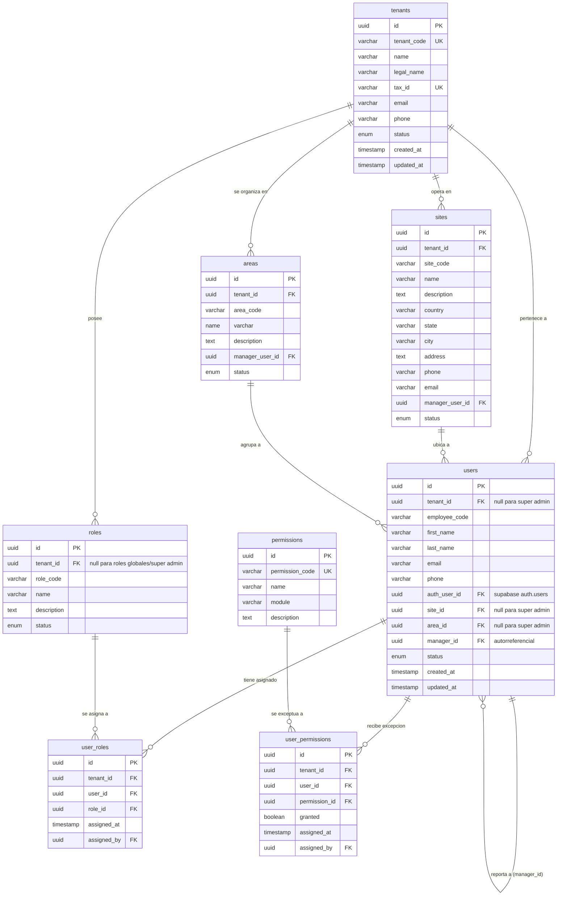

# DIAGRAMA ENTIDAD-RELACIÓN (ENTITY RELATIONSHIP DIAGRAM)

Este documento detalla el diseño relacional para la **FASE 1: Fundación y Core Multiempresa / Seguridad** del sistema.

---

## 1. Diagrama de Clases / Relaciones (Mermaid)

---

## 2. Especificación Técnica de Tablas e Índices

### 2.1 Tabla `tenants`
*   **Restricciones:**
    - `tenant_code` y `tax_id` son de tipo `NOT NULL` y obligatoriamente únicos globales (`UNIQUE`).
    - `status` toma valores del enum: `'Activo'`, `'Inactivo'`, `'Suspendido'`.
*   **Índices:**
    - `idx_tenants_code` (B-Tree en `tenant_code`) para resoluciones rápidas de login/dominio.
    - `idx_tenants_tax_id` (B-Tree en `tax_id`).

### 2.2 Tabla `users`
*   **Restricciones:**
    - `tenant_id` puede ser `NULL` únicamente si `is_platform_user` (definido en el modelo lógico) es verdadero, habilitando el bypass de RLS para el rol de `SUPER_ADMIN`.
    - La combinación `(tenant_id, email)` es única. Un mismo correo no puede repetirse en la misma empresa, pero sí podría existir en empresas distintas.
    - `auth_user_id` referencia obligatoriamente al ID de la tabla `auth.users` del esquema interno de Supabase Auth.
*   **Índices:**
    - `idx_users_tenant_email` (B-Tree en `(tenant_id, email)`).
    - `idx_users_auth_id` (B-Tree en `auth_user_id`).
    - `idx_users_tenant_id` (B-Tree en `tenant_id`) para consultas optimizadas bajo RLS.

### 2.3 Tabla `roles`
*   **Restricciones:**
    - La combinación `(tenant_id, role_code)` es única.
    - `tenant_id` es `NULL` para roles globales predefinidos del sistema.
*   **Índices:**
    - `idx_roles_tenant_code` (B-Tree en `(tenant_id, role_code)`).

### 2.4 Tabla `permissions`
*   **Restricciones:**
    - `permission_code` es de tipo `NOT NULL` y único global (ej. `clients.create`, `quotes.approve`).
*   **Índices:**
    - `idx_permissions_code` (B-Tree en `permission_code`).

### 2.5 Tabla `user_roles`
*   **Restricciones:**
    - Claves foráneas referenciando a `users(id)` y `roles(id)` con `ON DELETE CASCADE`.
*   **Índices:**
    - `idx_user_roles_composite` (B-Tree en `(user_id, role_id)`).
    - `idx_user_roles_tenant` (B-Tree en `tenant_id`) para RLS.

### 2.6 Tabla `user_permissions`
*   **Restricciones:**
    - `granted` es booleano. Permite inyectar excepciones de permisos (p. ej., habilitar a un usuario específico una acción (`granted = true`) o revocarle explícitamente un permiso heredado (`granted = false`)).
*   **Índices:**
    - `idx_user_permissions_composite` (B-Tree en `(user_id, permission_id)`).

### 2.7 Tabla `sites` (Sedes)
*   **Restricciones:**
    - La combinación `(tenant_id, site_code)` es única.
*   **Índices:**
    - `idx_sites_tenant_code` (B-Tree en `(tenant_id, site_code)`).

### 2.8 Tabla `areas`
*   **Restricciones:**
    - La combinación `(tenant_id, area_code)` es única.
*   **Índices:**
    - `idx_areas_tenant_code` (B-Tree en `(tenant_id, area_code)`).
