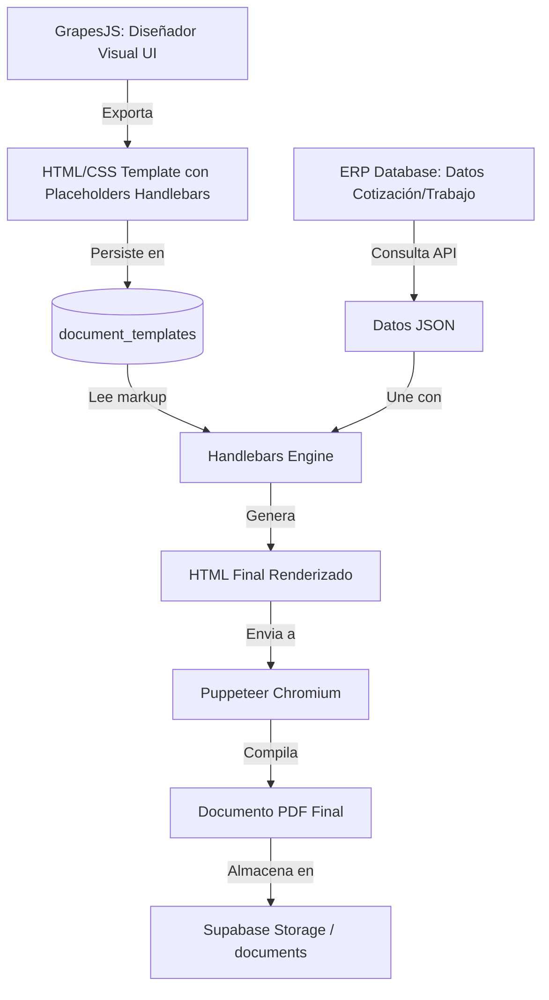

# ANÁLISIS DE REUTILIZACIÓN DE ACTIVOS DE TERCEROS (OPEN SOURCE) - FASE 18

Este documento cumple obligatoriamente con el protocolo de gobernanza **Modo Auditor 0.3** y las directrices específicas de la Fase 18 para evaluar la viabilidad de reutilización de librerías y herramientas de código abierto especializadas en edición visual, renderizado de plantillas y generación de archivos PDF/DOCX en el ERP B2B Premium.

---

## 1. Evaluación de Repositorios Especializados (Mínimo 5)

### 1.1 GrapesJS (Editor Visual de HTML/CSS)
*   **Licencia:** BSD 3-Clause (Comercialmente amigable, permisiva).
*   **Stars:** ~19.5k+ en GitHub.
*   **Actividad:** Alta. Commits semanales, lanzamientos frecuentes y una amplia comunidad de plugins.
*   **Tiempo de Integración:** 1 a 2 días (desarrollo de un componente React/Vue/Svelte o JS puro dentro del portal).
*   **Complejidad:** Media. Cuenta con APIs completas para definir bloques personalizados y serializar HTML/CSS.

### 1.2 Handlebars.js (Motor de Plantillas HTML)
*   **Licencia:** MIT (Altamente permisiva, comercialmente viable).
*   **Stars:** ~17.5k+ en GitHub.
*   **Actividad:** Estable. Lanzamientos de seguridad y mantenimiento. Es un estándar de la industria.
*   **Tiempo de Integración:** 1 a 2 horas (muy rápido de integrar en Node.js/TypeScript).
*   **Complejidad:** Baja. Sintaxis declarativa intuitiva `{{variable}}` con soporte para bucles y condicionales.

### 1.3 Puppeteer (Generación de PDF mediante Chromium Headless)
*   **Licencia:** Apache 2.0 (Permisiva para uso comercial).
*   **Stars:** ~87k+ en GitHub.
*   **Actividad:** Muy Alta. Mantenido activamente por Google, actualizaciones concurrentes con los lanzamientos de Chrome.
*   **Tiempo de Integración:** 4 a 6 horas (configuración en un servicio backend o función Lambda/Supabase Edge).
*   **Complejidad:** Media. Requiere configuración de Chromium en entornos de contenedor (Docker/Serverless).

### 1.4 Docxtemplater (Motor de Plantillas de MS Word / DOCX)
*   **Licencia:** MIT para el core (Licencia comercial para plugins avanzados de imágenes/tablas dinámicas).
*   **Stars:** ~2.5k+ en GitHub.
*   **Actividad:** Media. Lanzamientos regulares de mantenimiento.
*   **Tiempo de Integración:** 3 a 5 horas.
*   **Complejidad:** Media. Lee archivos zip de DOCX, procesa el XML interno y genera el flujo binario modificado.

### 1.5 Documenso (Gestión de Firmas Digitales / Firma Electrónica)
*   **Licencia:** AGPLv3 (Requiere precaución: si se modifica y expone como SaaS, los cambios deben ser libres. Para integración vía API sin tocar su core es seguro).
*   **Stars:** ~7.2k+ en GitHub.
*   **Actividad:** Muy Alta. Es una de las alternativas open-source a DocuSign de más rápido crecimiento.
*   **Tiempo de Integración:** 2 a 3 días (configuración del contenedor self-hosted y sincronización vía webhooks).
*   **Complejidad:** Alta. Es una aplicación independiente completa con base de datos propia.

---

## 2. Tabla Comparativa: Reutilización vs. Desarrollo Propio

| Dimensión | Enfoque Reutilización Open Source (GrapesJS + Handlebars + Puppeteer + Docxtemplater) | Enfoque Desarrollo Propio (replace('{{var}}') en Postgres) |
| :--- | :--- | :--- |
| **Costo de Desarrollo** | **Bajo a Medio** (Configuración de integraciones estándar). | **Alto** (Crear editor visual y parser de PDF desde cero es inviable; implementar stubs es barato pero inútil para el negocio). |
| **Tiempo de Entrega** | **1 a 3 días** para todo el pipeline funcional. | **Semanas o meses** (si se intenta dar una experiencia interactiva equivalente). |
| **Calidad de Salida (PDF)** | **Excelente** (Píxel-perfect a través del motor Blink de Chromium). | **Deficiente/Limitada** (PostgreSQL o parsers simples no manejan CSS moderno, flexbox o grid). |
| **Mantenimiento a largo plazo** | A cargo de Google, la comunidad de GrapesJS y Handlebars. | Interno 100% (parchear bugs de renderizado, saltos de página en PDFs, soporte de tablas). |
| **Flexibilidad del Diseñador** | **Total** (Diseño arrastrar y soltar, exportación de HTML limpio). | **Ninguna** (El usuario debe editar código HTML crudo en base de datos). |

---

## 3. Justificación y Arquitectura de la Fase 18

Queda **estrictamente prohibido** implementar una función simple de base de datos `replace('{{variable}}')` para la lógica principal de plantillas debido a que:
1.  **Inviabilidad del Negocio:** Los clientes de un ERP B2B premium exigen formatos de cotización y actas píxel-perfect con logotipos, tablas dinámicas de ítems, y condiciones comerciales complejas. Una función simple de string replacement falla en renderizar saltos de página consistentes o layouts adaptables.
2.  **Duplicación de Esfuerzos:** Handlebars.js ya resuelve la compilación con seguridad, escape de HTML y helper iterators (`#each`) necesarios para desglosar cotizaciones e ítems.
3.  **Seguridad y Aislamiento:** Puppeteer permite el renderizado aislado de HTML a PDF.

### Arquitectura Seleccionada para el Flujo de Documentos:

Esta solución balancea perfectamente el cumplimiento de la **Regla Suprema No Inventar** en el backend y la excelencia visual premium demandada para la aplicación Web.
