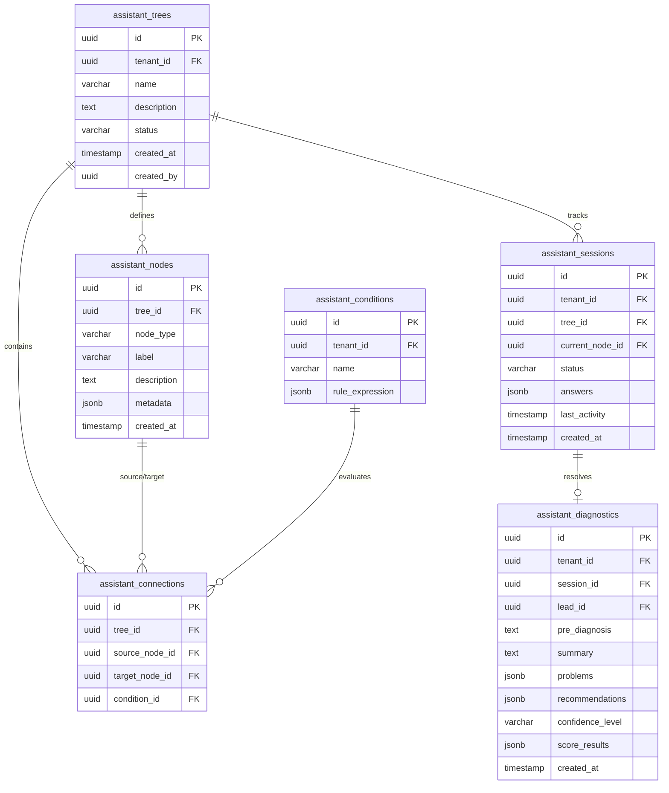

# FASE 35: Asistente de Preingeniería Industrial
# 01_DATABASE: Modelo Relacional y Esquema de Base de Datos

Este documento define la estructura de tablas, tipos, índices, triggers y políticas de Row Level Security (RLS) necesarias para soportar el **Asistente de Preingeniería Industrial** en la base de datos de Supabase.

---

## 1. Diagrama de Relaciones (MERM)



---

## 2. Definición de Tablas y Columnas

### 2.1 Tabla: `assistant_trees` (Árboles de Decisión)
Almacena las cabeceras de los árboles configurados por inquilino.
```sql
CREATE TABLE assistant_trees (
    id UUID PRIMARY KEY DEFAULT gen_random_uuid(),
    tenant_id UUID NOT NULL REFERENCES tenants(id),
    name VARCHAR(255) NOT NULL,
    description TEXT,
    status VARCHAR(50) NOT NULL DEFAULT 'INACTIVO' CHECK (status IN ('ACTIVO', 'INACTIVO')),
    created_at TIMESTAMPTZ NOT NULL DEFAULT NOW(),
    created_by UUID REFERENCES users(id),
    updated_at TIMESTAMPTZ NOT NULL DEFAULT NOW(),
    deleted_at TIMESTAMPTZ,
    deleted_by UUID REFERENCES users(id)
);
```

### 2.2 Tabla: `assistant_nodes` (Nodos del Árbol)
Representa preguntas, reglas, bifurcaciones o reportes dentro del árbol.
```sql
CREATE TABLE assistant_nodes (
    id UUID PRIMARY KEY DEFAULT gen_random_uuid(),
    tree_id UUID NOT NULL REFERENCES assistant_trees(id) ON DELETE CASCADE,
    node_type VARCHAR(50) NOT NULL CHECK (node_type IN ('QUESTION', 'RULE_EVAL', 'DIAGNOSTIC', 'END')),
    label VARCHAR(255) NOT NULL,
    description TEXT,
    metadata JSONB NOT NULL DEFAULT '{}'::jsonb, -- Almacena opciones de respuesta, tipos de input, etc.
    created_at TIMESTAMPTZ NOT NULL DEFAULT NOW()
);
```

### 2.3 Tabla: `assistant_conditions` (Expresiones de Reglas)
Especifica las expresiones lógicas reutilizables para tomar bifurcaciones.
```sql
CREATE TABLE assistant_conditions (
    id UUID PRIMARY KEY DEFAULT gen_random_uuid(),
    tenant_id UUID NOT NULL REFERENCES tenants(id),
    name VARCHAR(255) NOT NULL,
    rule_expression JSONB NOT NULL, -- Ej: {"field": "temperatura", "operator": "greater_than", "value": 40}
    created_at TIMESTAMPTZ NOT NULL DEFAULT NOW()
);
```

### 2.4 Tabla: `assistant_connections` (Aristas / Conexiones)
Define las rutas entre nodos condicionadas a reglas.
```sql
CREATE TABLE assistant_connections (
    id UUID PRIMARY KEY DEFAULT gen_random_uuid(),
    tree_id UUID NOT NULL REFERENCES assistant_trees(id) ON DELETE CASCADE,
    source_node_id UUID NOT NULL REFERENCES assistant_nodes(id) ON DELETE CASCADE,
    target_node_id UUID NOT NULL REFERENCES assistant_nodes(id) ON DELETE CASCADE,
    condition_id UUID REFERENCES assistant_conditions(id) ON DELETE SET NULL,
    created_at TIMESTAMPTZ NOT NULL DEFAULT NOW()
);
```

### 2.5 Tabla: `assistant_sessions` (Sesiones de Entrevista)
Persistencia temporal y remarketing de abandonos de prospectos en el Wizard.
```sql
CREATE TABLE assistant_sessions (
    id UUID PRIMARY KEY DEFAULT gen_random_uuid(),
    tenant_id UUID NOT NULL REFERENCES tenants(id),
    tree_id UUID NOT NULL REFERENCES assistant_trees(id),
    current_node_id UUID REFERENCES assistant_nodes(id),
    status VARCHAR(50) NOT NULL DEFAULT 'IN_PROGRESS' CHECK (status IN ('IN_PROGRESS', 'COMPLETED', 'ABANDONED')),
    answers JSONB NOT NULL DEFAULT '{}'::jsonb, -- Almacena el historial de respuestas dadas por la sesión.
    last_activity TIMESTAMPTZ NOT NULL DEFAULT NOW(),
    created_at TIMESTAMPTZ NOT NULL DEFAULT NOW()
);
```

### 2.6 Tabla: `assistant_diagnostics` (Resultados de Preingeniería)
Almacena el prediagnóstico consolidado, scoring final y recomendaciones.
```sql
CREATE TABLE assistant_diagnostics (
    id UUID PRIMARY KEY DEFAULT gen_random_uuid(),
    tenant_id UUID NOT NULL REFERENCES tenants(id),
    session_id UUID NOT NULL REFERENCES assistant_sessions(id) ON DELETE CASCADE,
    lead_id UUID REFERENCES leads(id) ON DELETE SET NULL,
    pre_diagnosis TEXT NOT NULL,
    summary TEXT NOT NULL,
    problems JSONB NOT NULL DEFAULT '[]'::jsonb,
    recommendations JSONB NOT NULL DEFAULT '[]'::jsonb,
    confidence_level VARCHAR(50) NOT NULL CHECK (confidence_level IN ('ALTO', 'MEDIO', 'BAJO')),
    score_results JSONB NOT NULL DEFAULT '{}'::jsonb,
    created_at TIMESTAMPTZ NOT NULL DEFAULT NOW()
);
```

---

## 3. Políticas RLS (Seguridad SaaS Multi-Tenant)

Toda consulta debe ser filtrada automáticamente por inquilino.
```sql
-- RLS habilitado en todas las tablas
ALTER TABLE assistant_trees ENABLE ROW LEVEL SECURITY;
ALTER TABLE assistant_nodes ENABLE ROW LEVEL SECURITY;
ALTER TABLE assistant_conditions ENABLE ROW LEVEL SECURITY;
ALTER TABLE assistant_connections ENABLE ROW LEVEL SECURITY;
ALTER TABLE assistant_sessions ENABLE ROW LEVEL SECURITY;
ALTER TABLE assistant_diagnostics ENABLE ROW LEVEL SECURITY;

-- Política de aislamiento estándar para assistant_trees (Ejemplo aplicable a todas las tablas)
CREATE POLICY assistant_trees_tenant_isolation ON assistant_trees
    FOR ALL
    USING (tenant_id = auth.jwt()->>'tenant_id'::uuid OR auth.jwt()->>'role' = 'service_role');
```

---

## 4. Índices de Hardening / Rendimiento
Se crean índices parciales sobre registros no borrados lógicamente para optimizar las uniones.
```sql
CREATE INDEX idx_assistant_nodes_tree ON assistant_nodes(tree_id);
CREATE INDEX idx_assistant_connections_source ON assistant_connections(source_node_id);
CREATE INDEX idx_assistant_sessions_tenant_status ON assistant_sessions(tenant_id, status);
CREATE INDEX idx_assistant_diagnostics_session ON assistant_diagnostics(session_id);
```
